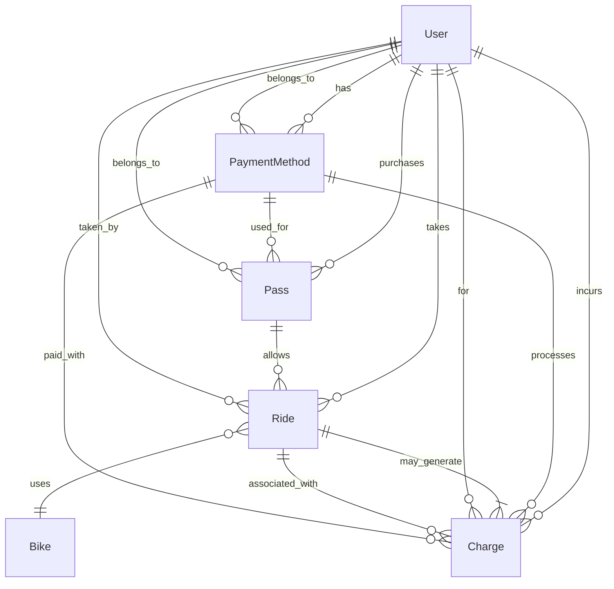

# Mastering SQL: Building a Bike Share Billing System from the Ground Up

In this article, I demonstrate how to design and implement a comprehensive billing system for a bike share service using SQL. We'll explore database schema design, write complex SQL queries, and adapt our solution across different SQL databases, including SQLite, DuckDB, and PostgreSQL. Whether you're a seasoned developer or new to SQL, this walkthrough will deepen your understanding of SQL's power in solving real-world problems.

## Problem Statement

Design a billing system for Divvy's bike share service with the following requirements:

- **`Day Pass Fee`**: Users can purchase a **Day Pass** for **$15**, allowing unlimited bike rides within a **24-hour period**.
  - Each ride can last up to **3 hours** without incurring additional charges.

- **`Overtime Charges`**: If a user keeps a bike out for longer than **3 hours** in a single ride, they are charged an additional **$3** for every additional **30 minutes** beyond the initial 3 hours.
  - Partial intervals are rounded up to the next full 30 minutes. For example, an extra 5 minutes over the 3-hour limit results in a full 30-minute charge.

- **`Edge Cases to Consider`**:
  - **`Pass Expiry`**: Rides that start before the Day Pass expires are included in the pass benefits, even if they end after the pass has expired.
  - **`Partial Intervals`**: Any time over the initial 3 hours is charged in full 30-minute increments, regardless of whether the full 30 minutes were used.

- **`Objective`**: Create a system that accurately tracks bike check-outs and check-ins, calculates ride durations, applies the correct charges including overtime fees, handles edge cases, and provides reporting capabilities for both users and the business.

## Database Schema Design

To implement this billing system, we'll start by designing a relational database schema that captures all the necessary entities and relationships.

### Entities and Relationships

1. **User**

2. **PaymentMethod**

3. **Pass**

4. **Bike**

5. **Ride**

6. **Charge**

### Entity-Relationship Diagram (ERD)



### Description of Relationships

- **User**:
  - Can have multiple **Payment Methods**.
  - Can purchase multiple **Passes**.
  - Can take multiple **Rides**.
  - Can incur multiple **Charges**.

- **PaymentMethod**:
  - Belongs to one **User**.
  - Can be used for multiple **Passes**.
  - Can process multiple **Charges**.

- **Pass**:
  - Belongs to one **User**.
  - Can be used for multiple **Rides**.

- **Ride**:
  - Taken by one **User**.
  - Uses one **Bike**.
  - May generate one **Charge**.

- **Bike**:
  - Can be used in multiple **Rides** over time.

- **Charge**:
  - For one **User**.
  - Associated with one **Ride**.
  - Paid with one **PaymentMethod**.

## Implementing the Database in SQLite with Python

We'll use Python to create the database, execute SQL scripts, and perform operations. This approach allows for automation and easier management of database interactions.

### Creating the Database Schema

First, we'll write the SQL commands for creating the tables in a file named **`schema.sql`**.

```sql
--- schema.sql

-- User Table
CREATE TABLE User (
    user_id INTEGER PRIMARY KEY AUTOINCREMENT,
    name TEXT NOT NULL,
    email TEXT UNIQUE NOT NULL,
    phone TEXT,
    created_at DATETIME DEFAULT CURRENT_TIMESTAMP
);

-- PaymentMethod Table
CREATE TABLE PaymentMethod (
    payment_method_id INTEGER PRIMARY KEY AUTOINCREMENT,
    user_id INTEGER NOT NULL,
    card_type TEXT NOT NULL,
    card_last_four TEXT NOT NULL,
    expiry_date TEXT NOT NULL,
    billing_address TEXT,
    is_default INTEGER DEFAULT 0,
    tokenized_card_info TEXT NOT NULL,
    created_at DATETIME DEFAULT CURRENT_TIMESTAMP,
    FOREIGN KEY(user_id) REFERENCES User(user_id)
);

-- Pass Table
CREATE TABLE Pass (
    pass_id INTEGER PRIMARY KEY AUTOINCREMENT,
    user_id INTEGER NOT NULL,
    payment_method_id INTEGER NOT NULL,
    purchase_time DATETIME DEFAULT CURRENT_TIMESTAMP,
    expiry_time DATETIME NOT NULL,
    FOREIGN KEY(user_id) REFERENCES User(user_id),
    FOREIGN KEY(payment_method_id) REFERENCES PaymentMethod(payment_method_id)
);

-- Bike Table
CREATE TABLE Bike (
    bike_id INTEGER PRIMARY KEY AUTOINCREMENT,
    status TEXT NOT NULL, -- e.g., 'available', 'in_use', 'maintenance'
    current_location TEXT,
    last_maintenance DATETIME
);

-- Ride Table
CREATE TABLE Ride (
    ride_id INTEGER PRIMARY KEY AUTOINCREMENT,
    user_id INTEGER NOT NULL,
    pass_id INTEGER NOT NULL,
    bike_id INTEGER NOT NULL,
    checkout_time DATETIME NOT NULL,
    checkin_time DATETIME,
    duration_minutes INTEGER,
    FOREIGN KEY(user_id) REFERENCES User(user_id),
    FOREIGN KEY(pass_id) REFERENCES Pass(pass_id),
    FOREIGN KEY(bike_id) REFERENCES Bike(bike_id)
);

-- Charge Table
CREATE TABLE Charge (
    charge_id INTEGER PRIMARY KEY AUTOINCREMENT,
    ride_id INTEGER NOT NULL,
    user_id INTEGER NOT NULL,
    payment_method_id INTEGER NOT NULL,
    amount REAL NOT NULL,
    charge_time DATETIME DEFAULT CURRENT_TIMESTAMP,
    FOREIGN KEY(ride_id) REFERENCES Ride(ride_id),
    FOREIGN KEY(user_id) REFERENCES User(user_id),
    FOREIGN KEY(payment_method_id) REFERENCES PaymentMethod(payment_method_id)
);
```

### Executing the Schema Script with Python

Create a Python script named **`setup_database.py`** to execute the schema script and create the database.

```python
# setup_database.py

import sqlite3

def create_database():
    # Connect to the SQLite database (creates it if it doesn't exist)
    connection = sqlite3.connect('bike_share.db')
    cursor = connection.cursor()

    # Read the schema SQL script
    with open('schema.sql', 'r') as f:
        schema_script = f.read()

    # Execute the schema script
    cursor.executescript(schema_script)

    # Commit changes and close the connection
    connection.commit()
    connection.close()
    print("Database created successfully.")

if __name__ == "__main__":
    create_database()
```

Run the script

```bash
python setup_database.py
```

**Outcome**: The SQLite database bike_share.db is created with all the tables defined in **`schema.sql`**.

## Practical Example: End-to-End Implementation Using Python

Let's walk through a complete example using Python to interact with the database, insert sample data, and simulate ride operations.

### Setting Up Sample Data

Create a Python script named **`sample_data.py`** to insert sample data into the database.

```python
# sample_date.py

import sqlite3

def insert_sample_data():
    connection = sqlite3.connect('bike_share.db')
    cursor = connection.cursor()

    try:
        # Begin transaction
        connection.execute('BEGIN')

        # Create a sample user
        cursor.execute("""
            INSERT INTO User (name, email, phone)
            VALUES ('John Doe', 'john.doe@example.com', '555-1234')
        """)
        user_id = cursor.lastrowid

        # Add a payment method
        cursor.execute("""
            INSERT INTO PaymentMethod (user_id, card_type, card_last_four, expiry_date, billing_address, is_default, tokenized_card_info)
            VALUES (?, 'Visa', '1234', '12/2025', '123 Main St', 1, 'token_abc123')
        """, (user_id,))
        payment_method_id = cursor.lastrowid

        # Add a bike
        cursor.execute("""
            INSERT INTO Bike (status, current_location)
            VALUES ('available', 'Station A')
        """)
        bike_id = cursor.lastrowid

        # Purchase a Day Pass
        cursor.execute("""
            INSERT INTO Pass (user_id, payment_method_id, expiry_time)
            VALUES (?, ?, DATETIME('now', '+24 hours'))
        """, (user_id, payment_method_id))
        pass_id = cursor.lastrowid

        # Commit transaction
        connection.commit()
        print("Sample data inserted successfully.")

    except Exception as e:
        # Rollback transaction in case of error
        connection.rollback()
        print(f"Error inserting sample data: {e}")

    finally:
        connection.close()

if __name__ == "__main__":
    insert_sample_data()
```

Run the script

```bash
python sample_data.py
```

**Outcome**: Sample data is inserted into the **`User`**, **`PaymentMethod`**, **`Bike`**, and **`Pass`** tables.

### Starting a Ride

When a user starts a ride:

- Insert a new record into the **`Ride`** table with **`checkout_time`**.
- Update the bike's status to **`in_use`**.

Create a script named **`start_ride.py`** to simulate starting a ride.

```python
# start_ride.py

import sqlite3

def start_ride(user_id, pass_id, bike_id):
    connection = sqlite3.connect('bike_share.db')
    cursor = connection.cursor()

    try:
        # Begin transaction
        connection.execute('BEGIN')

        # Validate that the pass is still valid
        cursor.execute("""
            SELECT 1 FROM Pass WHERE pass_id = ? AND expiry_time >= DATETIME('now')
        """, (pass_id,))
        if cursor.fetchone() is None:
            raise Exception("Pass has expired or does not exist.")

        # Insert a new ride
        cursor.execute("""
            INSERT INTO Ride (user_id, pass_id, bike_id, checkout_time)
            VALUES (?, ?, ?, DATETIME('now'))
        """, (user_id, pass_id, bike_id))
        ride_id = cursor.lastrowid

        # Update bike status
        cursor.execute("""
            UPDATE Bike SET status = 'in_use' WHERE bike_id = ?
        """, (bike_id,))

        # Commit transaction
        connection.commit()
        print(f"Ride started successfully. Ride ID: {ride_id}")

    except Exception as e:
        # Rollback transaction in case of error
        connection.rollback()
        print(f"Error starting ride: {e}")

    finally:
        connection.close()

if __name__ == "__main__":
    # Assuming IDs are known from sample data
    start_ride(user_id=1, pass_id=1, bike_id=1)
```

Run the script

```bash
python start_ride.py
```

**Outcome**: A ride is started, and the bike's status is updated to **`in_use`**.

### Ending a Ride (Bike Check-in)

Create a script named **`end_ride.py`** to simulate ending a ride.

```python
# end_ride.py

import sqlite3
import math

def calculate_overtime_charge(duration_minutes):
    free_minutes = 180  # 3 hours * 60 minutes
    if duration_minutes <= free_minutes:
        return 0
    else:
        overtime_minutes = duration_minutes - free_minutes
        intervals = math.ceil(overtime_minutes / 30)
        charge_amount = intervals * 3  # $3 per 30-minute interval
        return charge_amount

def end_ride(ride_id, location):
    connection = sqlite3.connect('bike_share.db')
    cursor = connection.cursor()

    try:
        # Begin transaction
        connection.execute('BEGIN')

        # Update Ride with check-in details
        cursor.execute("""
            UPDATE Ride
            SET checkin_time = DATETIME('now'),
                duration_minutes = ROUND((JULIANDAY('now') - JULIANDAY(checkout_time)) * 1440)
            WHERE ride_id = ?
        """, (ride_id,))
        if cursor.rowcount == 0:
            raise Exception("Ride ID not found.")

        # Retrieve updated ride information
        cursor.execute("""
            SELECT user_id, bike_id, duration_minutes
            FROM Ride
            WHERE ride_id = ?
        """, (ride_id,))
        ride = cursor.fetchone()
        if ride:
            user_id, bike_id, duration_minutes = ride
        else:
            raise Exception("Ride not found.")

        # Calculate overtime charge
        amount = calculate_overtime_charge(duration_minutes)
        if amount > 0:
            # Get the user's default payment method
            cursor.execute("""
                SELECT payment_method_id
                FROM PaymentMethod
                WHERE user_id = ? AND is_default = 1
            """, (user_id,))
            payment_method = cursor.fetchone()
            if payment_method:
                payment_method_id = payment_method[0]
                # Insert the charge into the database
                cursor.execute("""
                    INSERT INTO Charge (ride_id, user_id, payment_method_id, amount, charge_time)
                    VALUES (?, ?, ?, ?, DATETIME('now'))
                """, (ride_id, user_id, payment_method_id, amount))
                print(f"Overtime charge of ${amount} applied.")
            else:
                raise Exception("No default payment method found for the user.")
        else:
            print("No overtime charge applied.")

        # Update Bike status
        cursor.execute("""
            UPDATE Bike
            SET status = 'available', current_location = ?
            WHERE bike_id = ?
        """, (location, bike_id))

        # Commit transaction
        connection.commit()
        print("Ride ended successfully.")

    except Exception as e:
        # Rollback transaction in case of error
        connection.rollback()
        print(f"Error ending ride: {e}")

    finally:
        connection.close()

if __name__ == "__main__":
    # Assuming ride_id is known (e.g., from starting the ride)
    ride_id = 1
    location = 'Station B'

    # Simulate ride duration (adjust checkout_time for testing)
    connection = sqlite3.connect('bike_share.db')
    cursor = connection.cursor()
    # Set checkout_time to 3 hours and 45 minutes ago for testing overtime charge
    cursor.execute("""
        UPDATE Ride SET checkout_time = DATETIME('now', '-3 hours', '-45 minutes')
        WHERE ride_id = ?
    """, (ride_id,))
    connection.commit()
    connection.close()

    # End the ride
    end_ride(ride_id=ride_id, location=location)
```

Run the script

```bash
python end_ride.py
```

- **Expected Output**:
  - "Overtime charge of $6 applied."
  - "Ride ended successfully."

**Explanation**:

- **Ride Duration**: 225 minutes (3 hours and 45 minutes).
- **Overtime Minutes**: 225 - 180 = 45 minutes.
- **Overtime Intervals**: ceil(45 / 30) = 2 intervals.
- **Overtime Charge**: 2 * $3 = $6.

Verifying the Results

You can query the database to verify the data.

Check the Ride Table

```python
import sqlite3

def check_ride():
    connection = sqlite3.connect('bike_share.db')
    cursor = connection.cursor()

    cursor.execute("""
        SELECT ride_id, user_id, bike_id, duration_minutes
        FROM Ride
        WHERE ride_id = 1
    """)
    ride = cursor.fetchone()
    print("Ride Details:")
    print(f"Ride ID: {ride[0]}, User ID: {ride[1]}, Bike ID: {ride[2]}, Duration: {ride[3]} minutes")

    connection.close()

if __name__ == "__main__":
        check_ride()
```

Check the Charge Table

```python
import sqlite3

def check_charge():
    connection = sqlite3.connect('bike_share.db')
    cursor = connection.cursor()

    cursor.execute("""
        SELECT charge_id, amount, charge_time
        FROM Charge
        WHERE ride_id = 1
    """)
    charge = cursor.fetchone()
    if charge:
        print("Charge Details:")
        print(f"Charge ID: {charge[0]}, Amount: ${charge[1]}, Time: {charge[2]}")
    else:
        print("No charge found for this ride.")

    connection.close()

if __name__ == "__main__":
    check_charge()
```

Run the scripts

```bash
python check_ride.py
python check_charge.py
```

**Outcome**: You'll see the ride duration and the applied overtime charge.

## Migrating to DuckDB

### Why Migrate to DuckDB?

DuckDB is an in-process SQL OLAP database management system designed for analytical workloads. It offers several advantages:

- **Performance**: Optimized for analytical queries and can handle large datasets efficiently.
- **Ease of Use**: No server setup is required; it runs within the host process.
- **Integration**: Works seamlessly with Python and supports Pandas DataFrames.
- **Standard SQL Support**: Provides extensive SQL functionality, including window functions and advanced aggregations.

## Migrating to PostgreSQL

### Why Migrate to PostgreSQL?

PostgreSQL is a powerful, open-source object-relational database system with a strong reputation for reliability, feature robustness, and performance. Advantages include:

- **Scalability**: Handles large volumes of data and high concurrency.
- **Advanced Features**: Supports complex queries, transactions, and full-text search.
- **Security**: Offers robust authentication and access control.
- **Community Support**: Extensive documentation and a large community.
